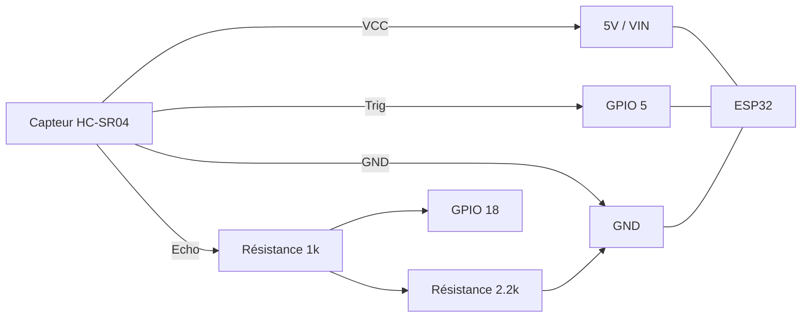

# Connexion du capteur HC-SR04 à l'ESP32

```mermaid
flowchart LR
       sensor[Capteur HC-SR04]
       esp[ESP32]
       vin[5V / VIN]
       gpio5[GPIO 5]
       gnd[GND]
       r1[Résistance 1k]
       gpio18[GPIO 18]
       r2[Résistance 2.2k]

       sensor -- VCC --> vin
       vin --- esp
       sensor -- Trig --> gpio5
       gpio5 --- esp
       sensor -- GND --> gnd
       gnd --- esp
       sensor -- Echo --> r1
       r1 --> gpio18
       r1 --> r2
       r2 --> gnd
```
